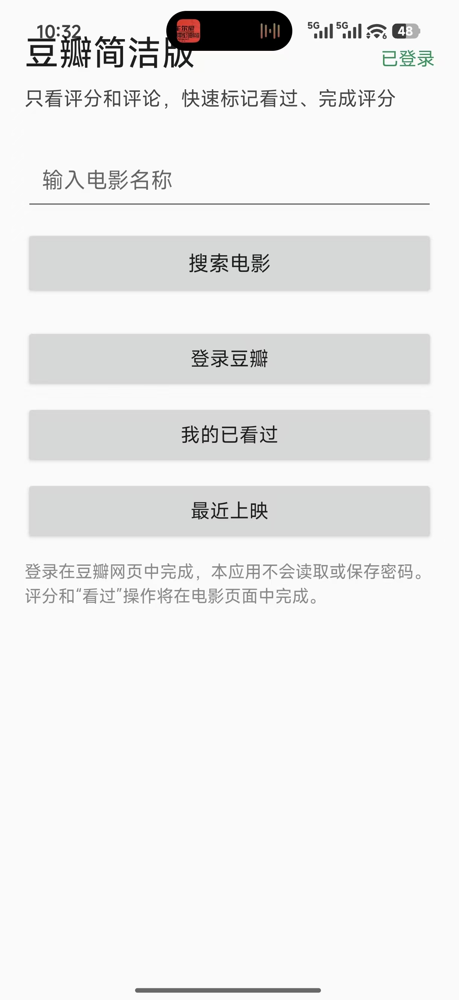
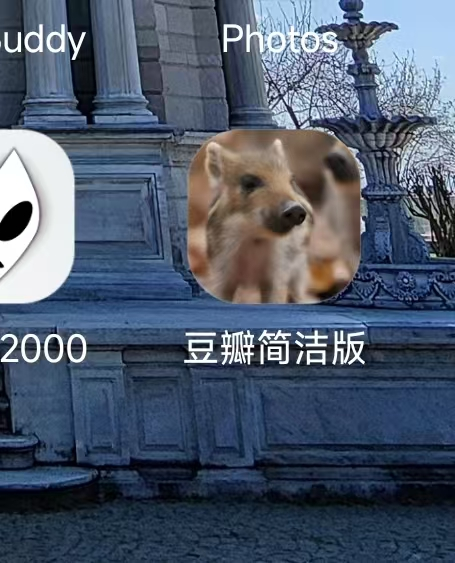

# 豆瓣简洁版

这是一个仅供个人使用的 Android MVP，目标设备为小米 17。它不依赖豆瓣官方 API，不收集豆瓣密码，通过豆瓣移动网页完成登录、查看评分与评论、标记看过和评分。

## 下载

[下载豆瓣简洁版 v1.4.1 APK](豆瓣简版-v1.4.1-问题修复.apk)

## 当前功能

- 原生大字体电影搜索入口
- 豆瓣移动网页搜索和详情页
- WebView 内完成豆瓣登录
- 首页右上角显示当前豆瓣登录状态
- 首页提供豆瓣“最近上映”入口
- 保留豆瓣网页中的评分与“看过”操作
- 查看豆瓣账号中的“已看过”记录
- 清除本地登录 Cookie
- 使用小野猪照片作为应用图标
- 登录页验证码弹层完整显示并支持滑动
- 隐藏豆瓣网页中的 App 推广弹窗
- 禁用缩放并提高网页文字可读性

## 构建

需要 Android Studio 或命令行 Android SDK、JDK 17 和 Android SDK Platform 35。打开项目后运行 `app` 配置即可生成 debug APK。

已在命令行环境中成功构建。可安装文件位于项目根目录的 `豆瓣简版-v1.4.1-问题修复.apk`。

首页的“我的已看过”入口会打开豆瓣账号电影记录页，列表来自豆瓣账号本身，不在应用内另存一份。

首页右上角通过豆瓣登录 Cookie 显示“已登录”或“未登录”，从网页返回首页后会自动刷新。“最近上映”入口直接打开豆瓣的正在上映页面。

## 重要限制

豆瓣网页改版、登录风控或验证码可能影响功能。评分和“看过”操作是在豆瓣网页中完成，应用不会绕过验证码，也不保证隐藏豆瓣服务器返回的全部广告。

本项目是非官方个人项目，与豆瓣无隶属或授权关系。“豆瓣”及相关标识归其权利人所有。
